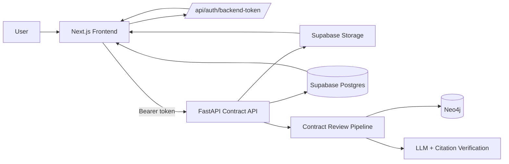
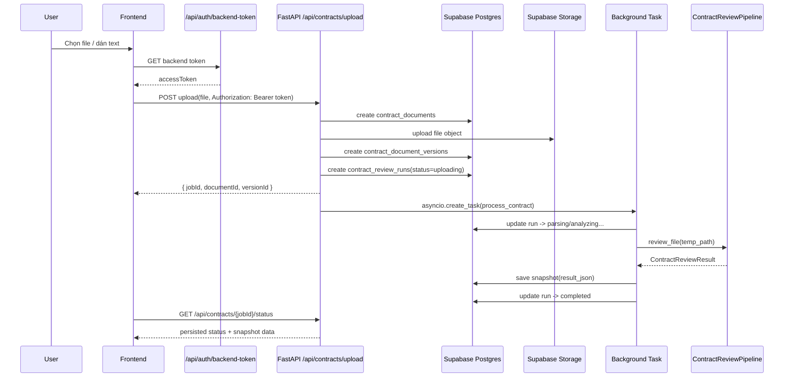
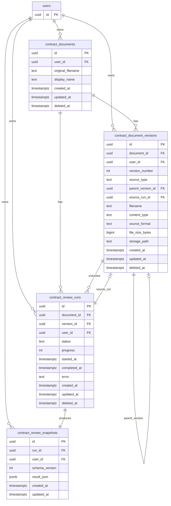

# Contract Review Architecture

Tài liệu này mô tả kiến trúc hiện tại của tính năng `Rà soát hợp đồng` theo cách end-to-end:

- frontend upload và restore kết quả
- backend chạy pipeline phân tích
- Supabase lưu document, version, run, snapshot
- sidebar/dashboard đọc history đã persist
- file gốc được giữ trong Supabase Storage

Mục tiêu của thiết kế này là biến Contract Review từ mô hình chỉ nhớ tạm trong memory thành mô hình document-centric có ownership rõ ràng, restore được sau refresh và có nền tảng cho version lineage về sau.

## 1. Mục tiêu kiến trúc

Thiết kế Contract Review hiện tại theo các nguyên tắc sau:

- Mỗi hợp đồng là một `contract_document` lâu dài.
- Mỗi lần upload tạo một `contract_document_version`.
- Mỗi version hiện tại chỉ tạo một `contract_review_run`.
- Mỗi run có một `contract_review_snapshot` để restore toàn bộ UI.
- File gốc được lưu trong Supabase Storage, không nằm trong database.
- Xóa là soft delete: row vẫn còn để audit và tránh mất dữ liệu.
- Ownership được enforce ở backend bằng `user_id`.
- Frontend vẫn giữ compatibility với từ khóa `jobId`, nhưng thực chất đó là `contract_review_runs.id`.

## 2. Kiến trúc tổng quan



Luồng chính:

1. User upload file hoặc dán text vào frontend.
2. Frontend lấy backend token từ `/api/auth/backend-token`.
3. Frontend gọi FastAPI với Bearer token.
4. FastAPI xác thực user qua `src/auth.py`.
5. FastAPI tạo document/version/run trong Supabase.
6. File được upload vào Supabase Storage.
7. Background task chạy parser, extractor, matcher, analyzer, verifier.
8. Kết quả được serialize vào `contract_review_snapshots.result_json`.
9. Khi refresh hoặc mở lại run, frontend đọc snapshot để restore UI.

## 3. Các lớp trong hệ thống

### 3.1 Frontend

Các file chính:

- `frontend/src/app/(app)/contract-review/page.tsx`
- `frontend/src/lib/api-contract.ts`
- `frontend/src/lib/api-client.ts`
- `frontend/src/components/layout/sidebar.tsx`

Vai trò của frontend:

- upload file hoặc nội dung text
- hiển thị preview
- poll trạng thái run
- restore kết quả từ snapshot đã persist
- hiển thị history ở sidebar và dashboard
- soft delete document từ UI

### 3.2 Backend FastAPI

Các file chính:

- `infra/api/contract_routes.py`
- `infra/api/contract_store.py`
- `infra/api/models.py`

Vai trò của backend:

- nhận upload và validate file
- persist metadata sang Supabase
- chạy pipeline phân tích ở background
- lưu snapshot kết quả
- cung cấp status/history cho frontend
- enforce ownership theo `user_id`

### 3.3 Pipeline xử lý hợp đồng

File chính:

- `src/contract/review_pipeline.py`

Pipeline thực thi theo thứ tự:

1. parse tài liệu
2. extract clauses
3. match legal provisions
4. analyze compliance
5. verify citations
6. serialize kết quả để lưu snapshot

### 3.4 Storage layer

Supabase được dùng theo 2 lớp:

- Postgres: lưu metadata, trạng thái, snapshot
- Storage: lưu file gốc

Backend truy cập Supabase bằng service role key, không phụ thuộc RLS cho flow này.

## 4. Luồng runtime chi tiết

### 4.1 Upload mới



### 4.2 Restore sau refresh

Khi user refresh hoặc mở lại `/contract-review?jobId=<id>`:

1. Frontend gọi `GET /api/contracts/{jobId}/status`.
2. Backend đọc `contract_review_runs`, `contract_document_versions`, `contract_review_snapshots`.
3. Backend tạo signed URL cho file gốc trong Storage.
4. Frontend nhận `previewText`, `clauses`, `matches`, `compliance`, `citations`.
5. Nếu file gốc là PDF thì render trực tiếp bằng `PDFViewer`.
6. Nếu là DOCX/DOC/TXT/MD thì frontend chuyển đổi lại sang PDF hoặc fallback sang `previewText`.

Điểm quan trọng:

- snapshot là nguồn restore chính của UI
- pipeline không chạy lại chỉ vì refresh
- `jobId` vẫn là khóa truy cập trạng thái cũ

### 4.3 Soft delete

Khi user xóa một contract ở sidebar hoặc dashboard:

1. Frontend gọi `DELETE /api/contracts/documents/{document_id}`.
2. Backend set `deleted_at` trên `contract_documents`.
3. Các bản version và run liên quan vẫn còn để audit, tùy cascade/quan hệ SQL hiện tại.
4. Item biến mất khỏi history mặc định.
5. File trong Storage không bị xóa.

## 5. Database architecture

Migration chính:

- `infra/supabase/007_contract_review_documents.sql`

Verify SQL:

- `infra/supabase/verify_contract_review_documents.sql`

Storage bucket:

- `contract-review-files`

### 5.1 ER diagram



### 5.2 Bảng `contract_documents`

Đây là identity lâu dài của một hợp đồng.

Ý nghĩa:

- đại diện cho tài liệu gốc mà user đã upload
- có thể đổi tên hiển thị mà không đổi identity
- hỗ trợ soft delete

Các cột:

- `id`: UUID của document
- `user_id`: owner
- `original_filename`: tên file gốc
- `display_name`: tên hiển thị trong UI
- `created_at`, `updated_at`
- `deleted_at`: soft delete marker

### 5.3 Bảng `contract_document_versions`

Bảng này lưu artifact file theo từng version.

Ý nghĩa:

- version đầu tiên là file upload gốc
- sau này có thể sinh version mới từ AI rewrite hoặc upload thủ công
- `source_run_id` và `parent_version_id` tạo lineage cho tương lai

Các cột chính:

- `document_id`: map về document cha
- `user_id`: owner
- `version_number`: thứ tự version trong một document
- `source_type`: `original_upload`, `ai_rewrite`, `manual_upload`
- `parent_version_id`: version cha nếu có
- `source_run_id`: run sinh ra version này nếu có
- `filename`, `content_type`, `source_format`
- `file_size_bytes`
- `storage_path`: đường dẫn object trong bucket
- `deleted_at`: soft delete marker

Storage path thực tế:

```text
{user_id}/{document_id}/v{version_number}/{sanitized_filename}
```

### 5.4 Bảng `contract_review_runs`

Đây là bảng trạng thái chạy phân tích.

Ý nghĩa:

- mỗi run gắn với một document version
- frontend poll vào bảng này qua API status
- trạng thái có thể đi qua nhiều stage

Các trạng thái hiện có:

- `uploading`
- `parsing`
- `extracting`
- `retrieving`
- `analyzing`
- `verifying`
- `completed`
- `failed`

Các cột:

- `document_id`
- `version_id`
- `user_id`
- `status`
- `progress`
- `started_at`
- `completed_at`
- `error`

### 5.5 Bảng `contract_review_snapshots`

Đây là nguồn restore chính cho UI.

Ý nghĩa:

- snapshot chứa toàn bộ dữ liệu cần render lại màn hình kết quả
- không cần chạy lại pipeline nếu snapshot đã tồn tại
- phù hợp cho refresh, mở lại tab, hoặc load history

Các cột:

- `run_id`: run sinh snapshot
- `user_id`
- `schema_version`: version của format snapshot
- `result_json`: payload JSONB đầy đủ

`result_json` thường chứa:

- `clauses`
- `matches`
- `citations`
- `compliance`
- `previewText`
- `sourceFormat`

## 6. Quan hệ dữ liệu và invariant

### 6.1 Invariant chính

- Một user sở hữu nhiều document.
- Một document có nhiều version.
- Một version có tối đa một run active theo design hiện tại.
- Một run có tối đa một snapshot chính.
- Mọi truy vấn backend phải filter theo `user_id`.
- Document bị xóa không được hard delete theo luồng thường xuyên dùng.

### 6.2 Vì sao dùng document/version/run tách riêng

Thiết kế này tách rõ 3 concern:

- `contract_documents`: identity
- `contract_document_versions`: file artifact
- `contract_review_runs`: trạng thái xử lý
- `contract_review_snapshots`: kết quả UI

Lợi ích:

- dễ restore UI
- dễ hỗ trợ AI rewrite trong tương lai
- dễ audit
- dễ mở rộng lineage version
- không bị trộn metadata file với trạng thái run

## 7. Backend architecture

### 7.1 `ContractStore`

`infra/api/contract_store.py` là lớp persistence chính.

Nó:

- đọc `NEXT_PUBLIC_SUPABASE_URL`
- đọc `SUPABASE_SERVICE_ROLE_KEY`
- mặc định bucket `contract-review-files`
- gọi Supabase PostgREST cho database
- gọi Supabase Storage REST cho upload/sign URL

Các thao tác chính:

- `upload_file()`
- `create_document()`
- `create_version()`
- `create_run()`
- `update_run()`
- `save_snapshot()`
- `get_run_bundle()`
- `list_runs()`
- `soft_delete_document()`

### 7.2 `contract_routes.py`

Các endpoint quan trọng:

- `POST /api/contracts/upload`
- `GET /api/contracts/{job_id}/status`
- `GET /api/contracts/history`
- `DELETE /api/contracts/documents/{document_id}`
- `GET /api/contracts/documents/{doc_title}` để load nội dung legal document từ Neo4j

Luồng upload trong code:

1. validate extension và size
2. tạo `document_id`, `version_id`, `run_id`
3. upload object vào Storage
4. insert document
5. insert version
6. insert run
7. spawn background task `process_contract`

### 7.3 Background processing

`process_contract()` thực hiện:

1. tạo file tạm từ bytes upload
2. update run sang `parsing`
3. chạy `ContractReviewPipeline.review_file()`
4. serialize kết quả
5. lưu snapshot vào Supabase
6. update run sang `completed`

Nếu pipeline fail:

- run được mark `failed`
- lỗi được lưu vào `error`

### 7.4 Serialization

`serialize_review_result()` chuyển object pipeline sang JSON snapshot.

Nó gom:

- danh sách clauses
- danh sách matches
- danh sách citations
- compliance summary
- preview text
- source format

Điểm đáng chú ý:

- `previewText` được repair mojibake trước khi lưu và trước khi trả về
- điều này giúp restore tiếng Việt ổn định

## 8. Frontend architecture

### 8.1 Upload and state flow

`frontend/src/app/(app)/contract-review/page.tsx` làm các việc:

- chọn file hoặc text
- upload qua `contractApi.uploadContract()`
- lưu `jobId` hiện tại
- poll `contractApi.getJobStatus(jobId)`
- khi completed thì hydrate UI từ status persisted

### 8.2 Restore

Khi nhận status completed, frontend:

- lấy `clauses`
- lấy `matches`
- lấy `compliance`
- lấy `citations`
- lấy `previewText`
- dựng lại preview PDF nếu cần

### 8.3 Preview logic

Logic preview hiện tại:

- nếu file gốc là PDF, dùng signed URL trực tiếp
- nếu không phải PDF, frontend tải file rồi convert lại thành PDF blob để render bằng `PDFViewer`
- nếu conversion fail, fallback sang `previewText`

Điều này quan trọng vì file text hoặc markdown không thể nhét thẳng vào iframe PDF.

### 8.4 History UI

Sidebar và dashboard đọc history thật từ backend:

- sidebar hiển thị dưới `Rà soát hợp đồng`
- có toggle show/hide history
- có delete button
- click item mở `/contract-review?jobId=...`
- event `contract-review:history-changed` dùng để refresh list ngay sau upload/delete

## 9. API contract

### 9.1 Upload response

Backend trả:

- `jobId`
- `documentId`
- `versionId`

### 9.2 Job status response

Backend trả:

- `jobId`
- `status`
- `progress`
- `filename`
- `createdAt`
- `documentId`
- `versionId`
- `fileUrl`
- `previewText`
- `sourceFormat`
- `clauses`
- `matches`
- `compliance`
- `citations`
- `error`

### 9.3 Compatibility layer

Frontend vẫn gọi run identifier là `jobId` để không phá compatibility với code cũ.

Nhưng về mặt domain:

- `jobId` = `contract_review_runs.id`
- `documentId` = `contract_documents.id`
- `versionId` = `contract_document_versions.id`

## 10. Security model

Kiến trúc hiện tại không dựa vào RLS cho flow này.

Thay vào đó:

- frontend lấy backend token từ Next.js auth bridge
- FastAPI xác thực token bằng `get_current_user`
- backend dùng service role để nói chuyện với Supabase
- mọi query đều phải gắn `user_id`

Hệ quả:

- client không được phép tự khai báo `user_id`
- backend là điểm enforcement ownership
- dữ liệu giữa các user bị tách bằng filter server-side

## 11. Rủi ro và điểm cần theo dõi

- `result_json` là snapshot JSONB, tiện cho restore nhưng chưa tối ưu cho analytics sâu.
- Storage object không bị xóa khi soft delete, nên cần policy dọn dẹp riêng nếu muốn tiết kiệm dung lượng.
- Hiện mới có một run chính cho một version, chưa có branching phức tạp.
- Nếu sau này bật RLS, backend contract và auth bridge sẽ cần đổi đồng bộ.
- Version lineage đã có cột, nhưng AI rewrite chưa được triển khai end-to-end.

## 12. Tóm tắt kiến trúc theo một câu

Contract Review hiện là một hệ thống document-centric: frontend upload vào FastAPI, FastAPI persist document/version/run/snapshot vào Supabase, background task chạy pipeline phân tích, còn UI restore lại từ snapshot để đảm bảo refresh không làm mất trạng thái.

